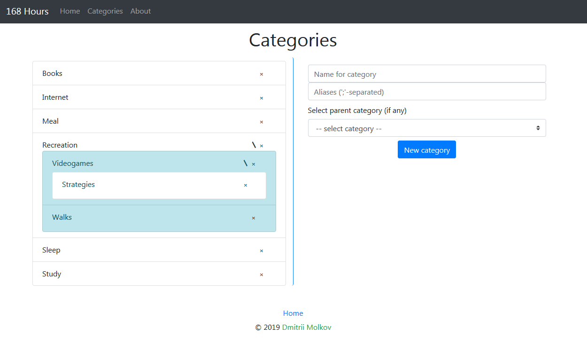

# Overview
### 168 Hours

This app can help you with balancing your time spending.
Just enter your hierarchy of activities in categories section, 
then add days, breaking them into time segments, and set 
category for each segment depending on what you spend it on.
 
This will allow you to look at your overall spending per 
category per week (or any other time period) and adjust you 
activity priorities.

Based on [_&#8220;168 Hours: You Have More Time Than You 
Think&#8221;_][168h]
by **Laura Vanderkam**

### Modules
App consists of three modules:
- **core**
  > Contains model classes with 
  > Javax Persistence API annotations, 
  > DAO interfaces, service interfaces 
  > and their DAO-based implementations. 
- **hibernate-persistence**
  > Contains Hibernate-based implementation 
  > of DAO interfaces from core module. Uses 
  > [H2 database engine][h2].
- **web**
  > Contains web UI. Uses Spring Boot with Thymeleaf, 
  > core and hibernate-persistence modules.

# Notes
This app is still in _early development_ and has only the 
most basic functionality implemented (like adding days with 
various segmentation types, adding categories and setting 
them to segments, editing comments on those segments).

I will add some analysis options and more data editing forms 
(including import and export).

#### Database
As of current version database is created in your user folder 
('hours168' directory).

#### Screenshots

> Timetable page

> Categories page

[168h]:https://lauravanderkam.com/books/168-hours/
[h2]:https://www.h2database.com/
